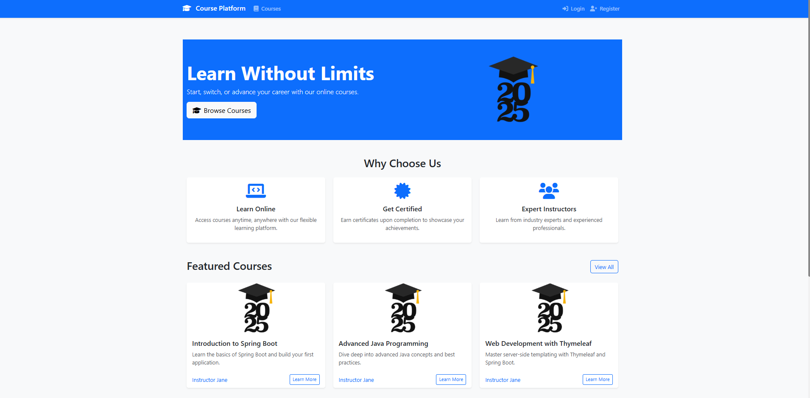
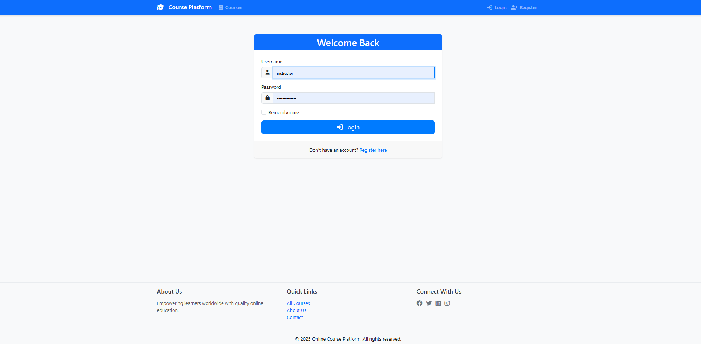
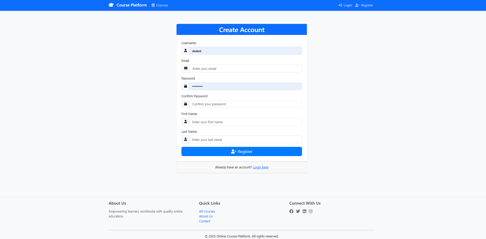
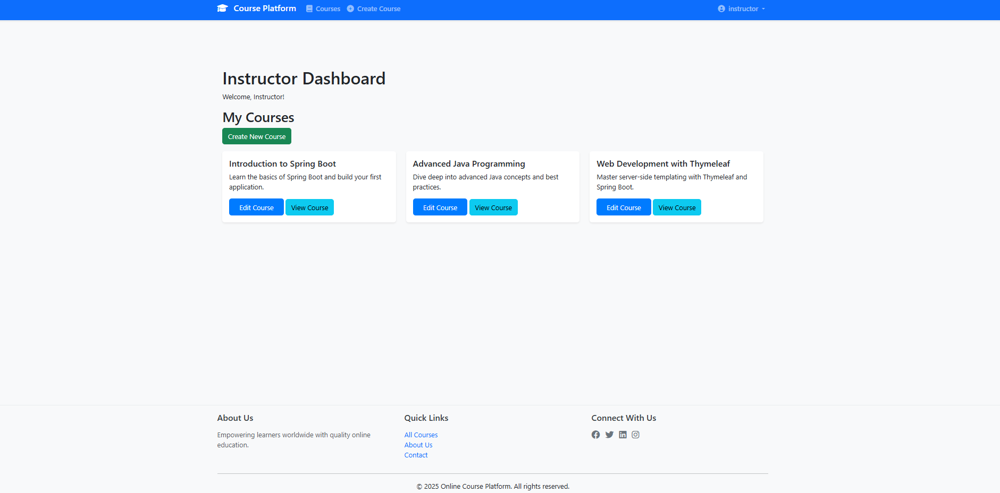
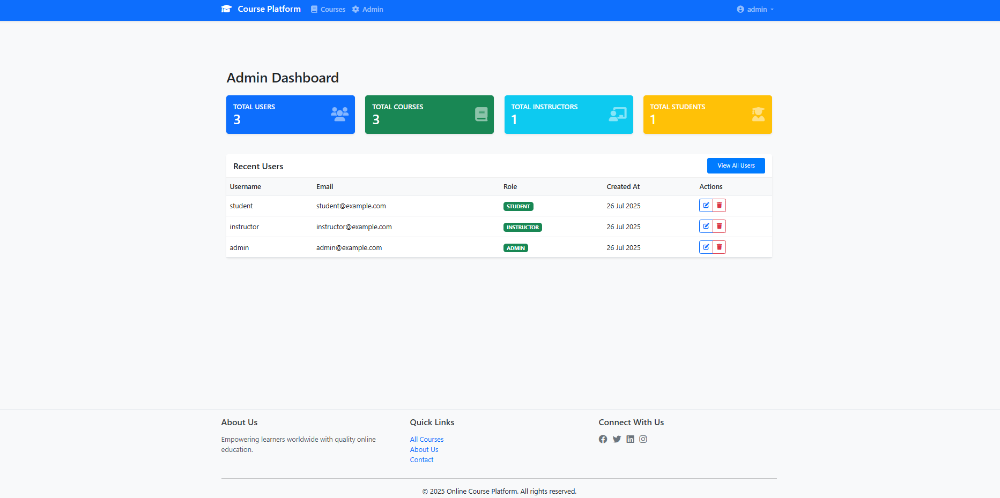
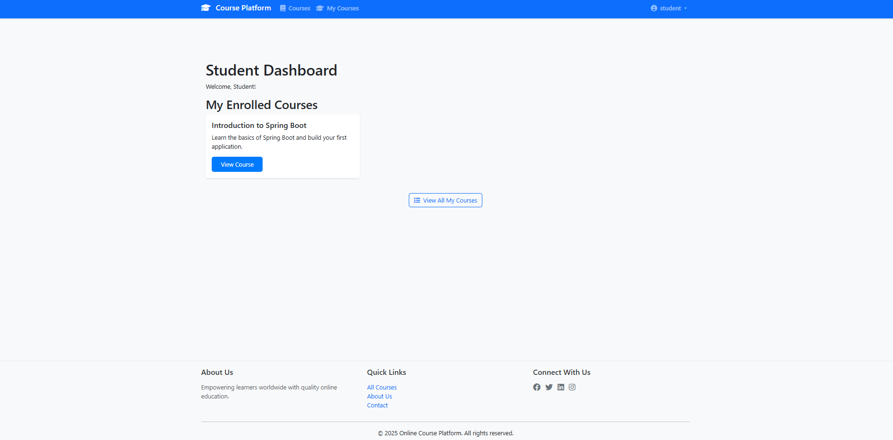

# Online Course Platform

<p align="center">
  
</p>

<br>

## Project Introduction

This is a Spring Boot application for an online course platform. The platform supports multiple user roles (Admin, Instructor, Student), course and lesson management, and secure authentication. Users can register, enroll in courses, and access personalized dashboards.

<br>

## Technologies Used

- **Backend:** Spring Boot 3.x, Java 17+
- **Database:** H2 (in-memory, JPA)
- **Frontend:** Thymeleaf, HTML, CSS, JavaScript
- **Security:** Spring Security
- **Build Tool:** Maven

<br>

## Core Features & Screenshots

### 1. Home Page

- Overview of the platform and featured courses.
<p align="center">
  
</p>

### 2. Registration Page

- New users can register as students or instructors.
<p align="center">
  
</p>

### 3. Login Page

- Secure login for all user roles.
<p align="center">
  
</p>

### 4. Instructor Dashboard

- Instructors can manage their courses and lessons.
<p align="center">
  
</p>

### 5. Admin Dashboard

- Admins can manage users and courses across the platform.
<p align="center">
  
</p>

### 6. Student Dashboard

- Students can view enrolled courses and track progress.
<p align="center">
  
</p>

<br>

## Quick Start: Login Credentials & Registration

You can log in with the following credentials:

- **Instructor:** `instructor`, password: `instructorpass`
- **Admin:** `admin`, password: `adminpass`
- **Student:** `student`, password: `studentpass`

Or, you can create any user by registering via the registration page.

<br>

## Project Requirements Overview

- **Backend:** Spring Boot 3.x
- **Database:** SQL database (H2 in-memory for development) with JPA.
- **Database Relations:** Must include OneToOne, OneToMany, ManyToOne, and ManyToMany relationships.
- **Web Interface:** Thymeleaf with Spring Security, a home menu, and CRUD functionality for at least one entity.
- **REST API:** CRUD interface (JSON) for all major entities.
- **Version Control:** Project hosted on GitLab.

<br>

## Prerequisites

- Java 17 or higher
- Apache Maven 3.6.x or higher

<br>

## Setup Instructions

1. **Clone the repository:**
    ```bash
    git clone <your-gitlab-repository-url>
    cd online-course-platform
    ```

2. **Build the project:**
    ```bash
    mvn clean install
    ```

<br>

## Running the Application

Once the project is built, you can run the application using the Spring Boot Maven plugin:

```bash
mvn spring-boot:run
```

The application will typically be available at `http://localhost:8081`.

> **Note:** Please ensure port **8081** is open and available on your system before running the application.

<br>

## API Endpoints

- **Users:** `/api/users`
- **Courses:** `/api/courses`
- **Lessons:** `/api/lessons`

Refer to the controller classes for detailed endpoint definitions and request/response formats.

<br>

## Web Interface

- **Home Page:** `/`
- **Login:** `/login`
- **Register:** `/register`
- **Courses:** `/courses`

<br>

## Database

- The application uses an H2 in-memory database by default for development.
- The H2 console can typically be accessed at `http://localhost:8080/h2-console` (ensure the path and credentials match your `application.yml` settings).
    - **JDBC URL:** `jdbc:h2:mem:testdb` (or as configured)
    - **Username:** `sa`
    - **Password:** `password` (or as configured) 